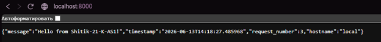
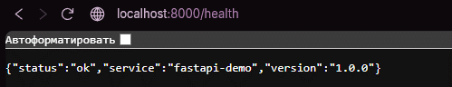
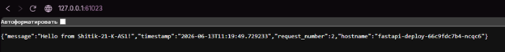
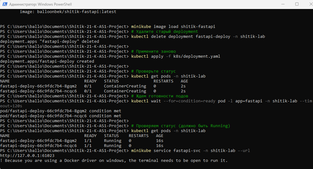
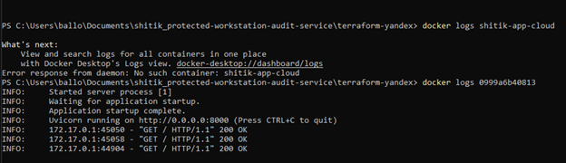
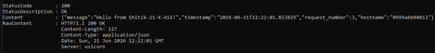
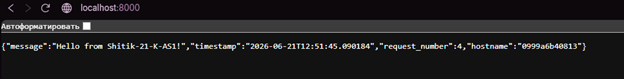
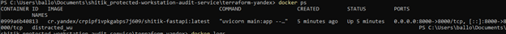
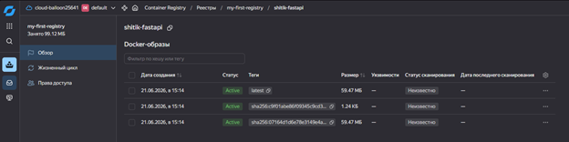

# Отчет по проекту Shitik-21-K-AS1

---

## 📋 Общая информация

| Параметр | Значение |
|----------|----------|
| **Студент** | Шитик |
| **Группа** | 21-К-АС1 |
| **Название проекта** | Shitik-21-K-AS1 |
| **Дата выполнения** | Июнь 2026 |

---

## 📌 Цель работы

Разработать REST API сервис на FastAPI, упаковать его в Docker, загрузить в Docker Hub, развернуть в Minikube и Yandex Cloud с использованием Terraform.

---

## 🛠️ Используемые технологии

- **Python 3.11** + **FastAPI** — разработка REST API
- **Docker** + **Docker Hub** — контейнеризация и хранение образов
- **Minikube** + **kubectl** — локальный Kubernetes кластер
- **Terraform** — инфраструктура как код (IaC)
- **Yandex Cloud** — облачный провайдер
- **Git** + **GitHub** — система контроля версий

---

## 🚀 Этапы выполнения

### 1. Установка необходимого ПО

Установлены следующие инструменты:
- Git, Python 3.11, Docker Desktop, Minikube, kubectl, Terraform, Yandex Cloud CLI, WSL 2

---

### 2. Создание FastAPI сервиса

Разработан REST API сервис с тремя эндпоинтами:

| Метод | Путь | Описание |
|-------|------|----------|
| GET | `/` | Приветственное сообщение |
| GET | `/health` | Проверка здоровья сервиса |
| GET | `/info` | Информация о сервисе |

**Зависимости:**

> `fastapi==0.104.1`, `uvicorn[standard]==0.24.0`, `pytest==7.4.3`, `httpx==0.25.1`

**Локальный запуск:**

```bash
cd app
pip install -r requirements.txt
uvicorn main:app --reload
```

> Результат: http://localhost:8000

---

### 3. Docker упаковка

Создан `Dockerfile` для контейнеризации приложения.

**Сборка образа:**

```bash
docker build -t shitik-fastapi ./app
```

**Запуск контейнера:**

```bash
docker run -d -p 8000:8000 --name shitik-app shitik-fastapi
```

> Результат: http://localhost:8000






---

### 4. Docker Hub

Образ загружен в публичный репозиторий Docker Hub.

```bash
docker login
docker tag shitik-fastapi balloonbek/shitik-fastapi:latest
docker push balloonbek/shitik-fastapi:latest
```

> **Ссылка:** https://hub.docker.com/r/balloonbek/shitik-fastapi

---

### 5. Kubernetes (Minikube)

Созданы манифесты для развертывания в Kubernetes:

- **Namespace:** `21-k-as1-lab`
- **Deployment:** 2 реплики приложения
- **Service:** LoadBalancer для доступа

**Запуск:**

```bash
minikube start --driver=docker
kubectl apply -f k8s/namespace.yaml
kubectl apply -f k8s/deployment.yaml
kubectl apply -f k8s/service.yaml
```

**Проверка:**

```bash
kubectl get pods -n 21-k-as1-lab
kubectl get svc -n 21-k-as1-lab
minikube service fastapi-svc -n 21-k-as1-lab --url
```

> Результат: 2 реплики запущены, сервис доступен

---

### 6. Terraform (Yandex Cloud)

Создана инфраструктура в Yandex Cloud с помощью Terraform:

- Виртуальная машина (2 vCPU, 2 GB RAM)
- VPC сеть и подсеть
- Автоматическая установка Docker и запуск контейнера

**Развертывание:**

```bash
cd terraform
terraform init
terraform plan
terraform apply
terraform output external_ip
```







---

## 📊 Результаты

### Эндпоинты API

| Метод | Путь | Описание | Пример ответа |
|-------|------|----------|---------------|
| GET | `/` | Приветствие | `{"message": "Hello from Shitik-21-K-AS1!", "timestamp": "...", "request_number": 1}` |
| GET | `/health` | Проверка здоровья | `{"status": "ok", "service": "fastapi-demo", "version": "1.0.0"}` |
| GET | `/info` | Информация | `{"author": "Шитик", "group": "21-К-АС1", "technology": "FastAPI"}` |

### Ссылки

| Ресурс | Ссылка |
|--------|--------|
| **GitHub** | https://github.com/balloobek/Shitik-21-K-AS1 |
| **Docker Hub** | https://hub.docker.com/r/balloonbek/shitik-fastapi |

---
